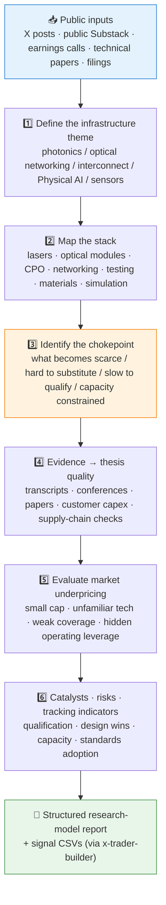

# 🔭 Gaetano / Crux Capital Research Model Skill

[简体中文](README.md) | **English**

> Reconstructs the public Gaetano / Crux Capital research method: turn public X posts, public Substack pages, earnings transcripts, and technical papers into a structured "photonics stack mapping → chokepoint discovery → evidence grading → catalyst & risk tracking" research model.


---

## 📖 What This Is

`gaetano-crux-capital-research-model` is a **portable agent skill** that teaches an agent to analyze photonics, optical networking, AI data-center interconnect, Physical AI, and robotics-infrastructure companies using the public Gaetano / Crux Capital research framework.

It ships with a fixed six-step research workflow, a 7-level semantic labeling system (separating forward-looking theses from technology explainers, quote-only mentions, and track-record posts), an explicit public-source boundary, and a set of **human-reviewed validation reports** (see `validation/`) that calibrate output quality.

This skill was produced with the workflow of its sister repository [`skill-x-trader-builder`](https://github.com/quantskills/skill-x-trader-builder); use that repo for batch data processing (signal extraction, semantic review, forward-return evaluation).

> ⚠️ Not a copy-trading tool: it does not reproduce paid Substack content, verify private portfolio returns, or recommend trades.

---

## ⚡ Research Workflow



---

## 🏷️ Semantic Labels

Every ticker-level public signal receives one of these labels; only the first two enter the forward signal set:

| Label | Meaning |
| --- | --- |
| ✅ `keep` | Complete forward thesis: company/tech + stack position + chokepoint + evidence + catalyst + risk |
| 🔉 `keep_deweighted` | Valid thesis missing one of evidence, timing, valuation, or risk |
| 📚 `deweight` | Technology education, sector overview, broad basket, or watchlist |
| ✂️ `delete_from_this_signal` | Ticker appears only in quote, comparison, or unrelated context |
| 🕰️ `remove_from_forward_signal_keep_as_track_record_context` | Retrospective performance / portfolio recap / marketing |
| 🧩 `keep_as_explainer_deweight` | Useful framework lesson not tied to a specific public signal |
| 🗑️ `delete` | Paid-only / private / duplicate / irrelevant content |

---

## 🚀 Quick Start

### 1️⃣ Install (recommended together with x-trader-builder)

```bash
# Claude Code (global)
cp -r skill-x-trader-builder                    ~/.claude/skills/x-trader-builder
cp -r skill-gaetano-crux-capital-research-model ~/.claude/skills/gaetano-crux-capital-research-model
```

For Codex / OpenClaw-style platforms, keep the `SKILL.md` + `references/` structure and import per platform convention; `agents/openai.yaml` provides the OpenAI/Codex adapter.

### 2️⃣ Trigger examples

```text
Use the Gaetano framework to place this CPO company in the photonics stack and find its chokepoint
Turn this batch of public Crux Capital posts into a structured research model
Extract the evidence and catalysts supporting the optical-module thesis from this earnings call
```

### 3️⃣ Validation baseline

`validation/` holds human-reviewed reports from a real-data MVP run (zh/en), a high-quality thesis template, and a price-coverage gap list — use them as the quality reference for outputs:

```text
validation/human_review_summary.md          # human review conclusions
validation/high_quality_thesis_template.md  # what a high-quality thesis looks like
validation/verification_log.md              # item-by-item verification log
```

---

## 📦 Repository Layout

```text
skill-gaetano-crux-capital-research-model/
├── SKILL.md                                  # Skill entrypoint: 6-step workflow + labels + output contract
├── references/
│   ├── trader_profile.md                     # 🧑‍💻 Public account profile & model-type statement
│   ├── research_template.md                  # 📄 Research-model report template
│   ├── review_rules.md                       # 🏷️ Semantic review rules
│   └── source_boundary.md                    # 🚧 Public-source boundary (allowed / forbidden)
├── validation/                               # ✅ Human-reviewed evidence from the real-data MVP
│   ├── human_review_summary.md
│   ├── human_review_recalculated_report_zh.md
│   ├── high_quality_thesis_template.md
│   ├── real_data_mvp_report.md
│   ├── gaetano_seed_mvp_status_zh.md
│   ├── verification_log.md
│   └── price_coverage_gap.csv
└── agents/
    └── openai.yaml                           # OpenAI/Codex adapter
```

---

## 📐 Core Constraints

| Constraint | Detail |
| --- | --- |
| 🌐 Public sources only | Public X posts, public Substack pages, filings, transcripts, papers, or user-owned exports |
| 🔒 No paid content | Never scrape or paraphrase paid Substack articles or member-only material |
| 🧾 No return endorsement | Public return claims are marked "unverified" unless backed by audited records |
| ✂️ Quotes stay quotes | Tickers appearing only in quoted/reposted context never count as forward signals |
| 🚫 Describe, don't recommend | Outputs are research structure and fact synthesis, never investment advice |
| 📦 Git hygiene | No raw exports, paid articles, large CSVs, or price histories in the repo |

---

## ⚠️ Disclaimer

This repository reconstructs a research method from public materials only. It is not affiliated with Gaetano / Crux Capital, does not verify any performance claims, and does not constitute investment advice.

## 📜 License

This project is licensed under the GNU General Public License v3.0. See [LICENSE](LICENSE).
