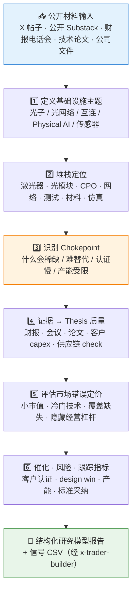

# 🔭 Gaetano / Crux Capital Research Model Skill

**简体中文** | [English](README.en.md)

> 基于公开资料复刻 Gaetano / Crux Capital 的研究方法：把公开 X 帖子、公开 Substack 页面、财报与技术论文，拆解成「光子堆栈定位 → chokepoint 识别 → 证据分级 → 催化与风险跟踪」的结构化研究模型。


---

## 📖 这是什么

`gaetano-crux-capital-research-model` 是一个**便携 Agent Skill**：教会 Agent 用 Gaetano / Crux Capital 的公开研究框架，去分析光子（Photonics）、光网络、AI 数据中心互连、Physical AI 与机器人基础设施类公司。

它内置了固定的六步研究工作流、一套 7 级语义标签体系（区分前瞻 thesis、技术科普、转发引用、历史战绩贴）、明确的公开资料边界，以及一组**人工复核过的验证报告**（见 `validation/`），用来校准模型产出质量。

本 Skill 由姊妹仓库 [`skill-x-trader-builder`](https://github.com/quantskills/skill-x-trader-builder) 的工作流生成；批量数据处理脚本（信号提取、语义复核、前向收益评估）请配合该仓库使用。

> ⚠️ 这不是跟单工具：不复制付费 Substack 内容、不验证私人组合收益、不给出买卖建议。

---

## ⚡ 研究工作流



---

## 🏷️ 语义标签体系

每条带 ticker 的公开信号都会被打上以下标签之一，只有前两类进入前瞻信号集：

| 标签 | 含义 |
| --- | --- |
| ✅ `keep` | 完整前瞻 thesis：公司/技术 + 堆栈位置 + chokepoint + 证据 + 催化 + 风险 |
| 🔉 `keep_deweighted` | 有效 thesis，但缺证据、时点、估值或风险之一 |
| 📚 `deweight` | 技术科普、行业综述、宽泛篮子或 watchlist |
| ✂️ `delete_from_this_signal` | ticker 只出现在引用、对比或无关上下文 |
| 🕰️ `remove_from_forward_signal_keep_as_track_record_context` | 历史战绩 / 组合回顾 / 营销性内容 |
| 🧩 `keep_as_explainer_deweight` | 有用的框架课，但不挂钩具体公开信号 |
| 🗑️ `delete` | 付费 / 私有 / 重复 / 无关内容 |

---

## 🚀 快速开始

### 1️⃣ 安装（建议与 x-trader-builder 一起）

```bash
# Claude Code（全局）
cp -r skill-x-trader-builder                    ~/.claude/skills/x-trader-builder
cp -r skill-gaetano-crux-capital-research-model ~/.claude/skills/gaetano-crux-capital-research-model
```

Codex / OpenClaw 等平台：保持 `SKILL.md` + `references/` 目录结构，按各自平台方式导入；`agents/openai.yaml` 提供 OpenAI/Codex 适配。

### 2️⃣ 触发示例

```text
用 Gaetano 框架分析这家 CPO 公司在光子堆栈里的位置和 chokepoint
把这批 Crux Capital 公开帖子整理成结构化研究模型
帮我提取这篇财报电话会里支持光模块 thesis 的证据和催化
```

### 3️⃣ 查看验证基线

`validation/` 目录保存了真实数据 MVP 跑批后的人工复核报告（中英文）、高质量 thesis 模板和价格覆盖缺口清单，可作为产出质量的参照系：

```text
validation/human_review_summary.md          # 人工复核结论
validation/high_quality_thesis_template.md  # 高质量 thesis 长什么样
validation/verification_log.md              # 逐项核验日志
```

---

## 📦 目录结构

```text
skill-gaetano-crux-capital-research-model/
├── SKILL.md                                  # 技能入口：六步工作流 + 语义标签 + 输出契约
├── references/
│   ├── trader_profile.md                     # 🧑‍💻 公开账号画像与模型类型声明
│   ├── research_template.md                  # 📄 研究模型报告模板
│   ├── review_rules.md                       # 🏷️ 语义复核规则
│   └── source_boundary.md                    # 🚧 公开资料边界（允许 / 禁止源）
├── validation/                               # ✅ 真实数据 MVP 的人工复核证据
│   ├── human_review_summary.md
│   ├── human_review_recalculated_report_zh.md
│   ├── high_quality_thesis_template.md
│   ├── real_data_mvp_report.md
│   ├── gaetano_seed_mvp_status_zh.md
│   ├── verification_log.md
│   └── price_coverage_gap.csv
└── agents/
    └── openai.yaml                           # OpenAI/Codex 适配
```

---

## 📐 核心约束

| 约束 | 说明 |
| --- | --- |
| 🌐 只用公开资料 | 公开 X 帖、公开 Substack 页面、公司文件、财报、论文，或用户自有导出 |
| 🔒 付费内容禁区 | 不抓取、不复述付费 Substack 文章及任何会员制内容 |
| 🧾 收益声明不背书 | 公开晒单、回报截图一律标记为「未验证」，除非有审计级记录 |
| ✂️ 引用归引用 | ticker 仅出现在引用/转发上下文时，不计入该账号的前瞻信号 |
| 🚫 只述不荐 | 输出研究结构与事实归纳，不构成任何投资建议 |
| 📦 Git 卫生 | 不提交原始导出、付费文章、大型 CSV 与价格历史数据 |

---

## ⚠️ 免责声明

本仓库仅对公开材料做研究方法层面的归纳与复刻，不代表 Gaetano / Crux Capital 官方，不验证任何收益声明，不构成任何投资建议。

## 📜 License

This project is licensed under the GNU General Public License v3.0. See [LICENSE](LICENSE).
